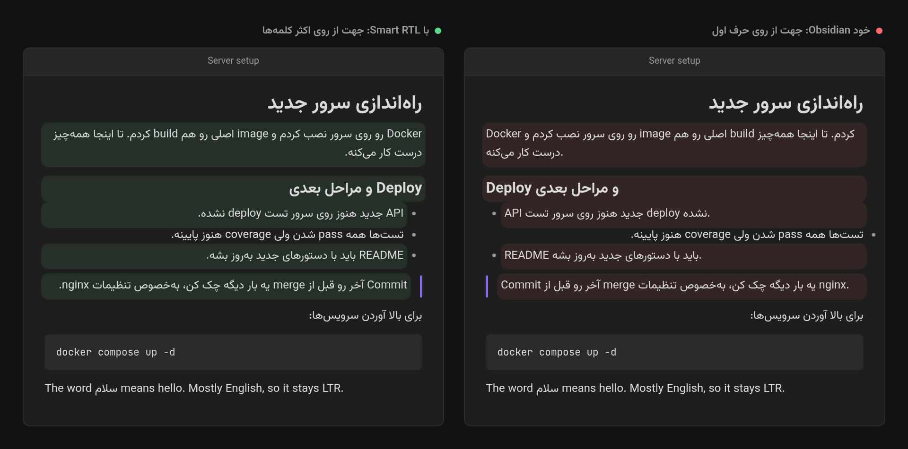

<div dir="rtl">

# Smart RTL

*[English](README.md)*

متن راست‌به‌چپ در Obsidian، بدون این‌که فقط چون خط با یک کلمه‌ی انگلیسی شروع شده چپ‌به‌راست شود.

Obsidian جهت هر خط را از **اولین حرفش** تعیین می‌کند. برای متن خالص فارسی، عربی یا عبری مشکلی نیست. ولی وقتی اصطلاح فنی زیاد می‌نویسی، خطی مثل

> checkpoint اول مهمه. بدون اون، اگه کشیدن خراب بشه…

چپ‌به‌راست نمایش داده می‌شود، چون با «checkpoint» شروع شده. کل پاراگراف فارسی است و خواندنش سخت می‌شود.

Smart RTL به‌جای حرف اول، **کلمه‌ها را می‌شمرد**. اگر به‌اندازه‌ی کافی از کلمه‌های یک خط راست‌به‌چپ باشند، آن خط راست‌به‌چپ می‌شود، با هر کلمه‌ای که شروع شده باشد.



*خط‌های رنگی همان‌هایی‌اند که Smart RTL جهتشان را عوض می‌کند. خط آخر بیشترش انگلیسی است و چپ‌به‌راست می‌ماند.*

## چه کار می‌کند

- **در Live Preview، حالت Source و Reading view.** هر خط، عنوان، آیتم لیست، نقل‌قول، عنوان callout و خانه‌ی جدول جهت خودش را می‌گیرد.
- **اکثریت، نه حرف اول.** خطی راست‌به‌چپ است که حداقل ۴۰٪ کلمه‌هایش راست‌به‌چپ باشند. این درصد را از تنظیمات می‌شود عوض کرد. «The word سلام means hello» چپ‌به‌راست می‌ماند و «checkpoint و مقدارهاش از کجا میان؟» راست‌به‌چپ می‌شود.
- **فقط متن خود نوشته شمرده می‌شود.** inline code، آدرس اینترنتی، مقصد لینک، embed، فرمول inline، شماره‌ی پانویس و علامت‌های لیست، تسک و callout حساب نمی‌شوند. در `[[some/english/path|این فایل]]` فقط اسم نمایشی شمرده می‌شود.
- **کد چپ‌به‌راست می‌ماند.** code block و بلوک ریاضی `$$` همیشه چپ‌به‌راست‌اند، حتی اگر فارسی داخلشان باشد. frontmatter دست نمی‌خورد.
- **خط خالی جهت متن بالایش را می‌گیرد.** برای همین مکان‌نما روی خط خالی همان طرفی است که داشتی می‌نوشتی.
- **لیست‌ها، نقل‌قول‌ها و جدول‌ها هم‌راستا می‌شوند.** لیست یا نقل‌قول جهت اکثر آیتم‌هایش را می‌گیرد، تا بولت و تورفتگی همان طرف متن باشد. ترتیب ستون‌های جدول از سطر عنوانش می‌آید، همان‌طور که خود Obsidian انجام می‌دهد.

با همه‌ی خط‌های راست‌به‌چپ کار می‌کند: فارسی، عربی، اردو، عبری، سریانی، تانا، انکو و بقیه.

## تنظیمات

- **Enabled** پلاگین را بدون غیرفعال کردنش روشن و خاموش می‌کند. وقتی خاموش باشد، رفتار معمول Obsidian (جهت از روی حرف اول) برمی‌گردد.
- **RTL threshold** سهمی از کلمه‌ها که باید راست‌به‌چپ باشند تا خط راست‌به‌چپ شود (۱۰ تا ۹۰٪، پیش‌فرض ۴۰٪). اگر می‌خواهی خط‌هایی که اصطلاح انگلیسی زیادی دارند هم راست‌به‌چپ شوند، کمش کن. اگر خط‌های انگلیسی با چند کلمه‌ی فارسی برعکس می‌شوند، زیادش کن.
- **Excluded folders** پلاگین روی یادداشت‌های این پوشه‌ها و زیرپوشه‌هایشان کاری نمی‌کند و رفتار معمول Obsidian سر جایش می‌ماند. اسم پوشه را که شروع به تایپ کنی، پوشه‌های والت پیشنهاد می‌شوند و از بینشان انتخاب می‌کنی. اگر یک پوشه‌ی مستثنا را تغییر نام بدهی یا جابه‌جا کنی، لیست هم خودش به‌روز می‌شود.

## دستورات

| دستور | کارش |
| --- | --- |
| Toggle on/off | همان تنظیم *Enabled*. می‌شود برایش کلید میان‌بر گذاشت. |

## نصب

تا وقتی در فهرست پلاگین‌های community نیامده، فایل‌های `main.js`، `manifest.json` و `styles.css` را از [آخرین release](https://github.com/milad-s5/obsidian-smart-rtl/releases/latest) دانلود کن. آن‌ها را در `<والت تو>/.obsidian/plugins/smart-rtl/` بگذار و بعد از Settings → Community plugins، *Smart RTL* را روشن کن.

## توسعه

</div>

```sh
npm install
npm run dev     # هر تغییر main.js را دوباره می‌سازد
npm test        # تست‌های تشخیص جهت
npm run build   # بررسی تایپ و build نهایی
```

<div dir="rtl">

برای امتحان در یک والت، `main.js`، `manifest.json` و `styles.css` را در `.obsidian/plugins/smart-rtl/` همان والت بگذار.

## حمایت

این پروژه رایگان عرضه شده تا همه بدون محدودیت بتوانند استفاده کنند. اگر برایت مفید بود، می‌توانی از ادامه‌ی توسعه‌اش حمایت کنی.

<a href="https://www.coffeete.ir/milads55">
  
</a>
<br><br>
<a href="https://buymeabitcoffee.vercel.app/btc/bc1qwxju09p2wywqqq8udj2am8csvn6r4p4z6720q3">
  
</a>

## پروانه

MIT — فایل [LICENSE](LICENSE).

</div>
