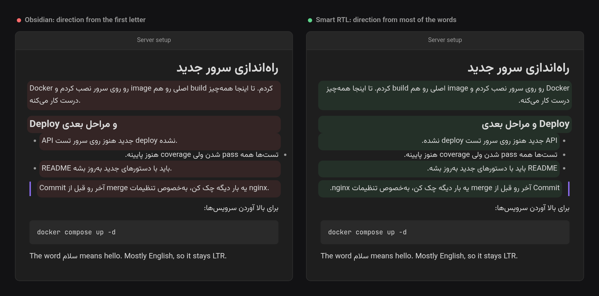

# Smart RTL

*[فارسی](README.fa.md)*

Right-to-left text in Obsidian that doesn't flip to left-to-right just because the line starts with an English word.

Obsidian picks the direction of each line from its first letter. That works for pure Persian, Arabic or Hebrew. But when you write a lot of technical terms, a line like

> checkpoint اول مهمه. بدون اون، اگه کشیدن خراب بشه…

is shown left-to-right because it starts with "checkpoint". The whole paragraph is Persian, and it becomes hard to read.

Smart RTL counts the words instead. If enough of a line's words are right-to-left, the line is right-to-left, whatever it starts with.



*Highlighted lines are the ones Smart RTL changes. The last line is mostly English, so it stays left-to-right.*

## What it does

- **Live Preview, Source mode and Reading view.** Every line, heading, list item, quote, callout title and table cell gets its own direction.
- **Majority, not first letter.** A line is RTL when at least 40% of its words are RTL. You can change this percentage in settings. "The word سلام means hello" stays LTR. "checkpoint و مقدارهاش از کجا میان؟" becomes RTL.
- **Only prose is counted.** Inline code, URLs, link targets, embeds, inline math, footnote markers, and list, task and callout markers are ignored. For `[[some/english/path|این فایل]]`, only the alias counts.
- **Code stays LTR.** Fenced code blocks and `$$` math blocks are always left-to-right, even with Persian inside. Frontmatter is left alone.
- **Blank lines follow the text above them,** so the cursor on an empty line sits on the side you were writing on.
- **Lists, quotes and tables line up.** A list or quote takes the direction of most of its items, so the bullets and indentation sit on the same side as the text. A table's column order follows its header row, the same way Obsidian does it.

It works with any right-to-left script: Persian, Arabic, Urdu, Hebrew, Syriac, Thaana, N'Ko and others.

## Settings

- **Enabled.** Turns the plugin on and off without disabling it. When it's off, Obsidian's usual first-letter behaviour comes back.
- **RTL threshold.** The share of RTL words at which a line becomes right-to-left (10–90%, default 40%). Lower it if lines with many English terms should still be RTL. Raise it if English lines with a few Persian words are flipping.
- **Excluded folders.** Notes in these folders, and in their subfolders, are left to Obsidian's usual first-letter behaviour. Start typing a folder's name and pick it from the suggestions. If you rename or move an excluded folder, the list follows it.

## Commands

| Command | What it does |
| --- | --- |
| Toggle on/off | Same as the *Enabled* setting. You can bind a hotkey to it. |

## Installing

Until it is in the community plugin list, download `main.js`, `manifest.json` and `styles.css` from the [latest release](https://github.com/milad-s5/obsidian-smart-rtl/releases/latest). Put them in `<your vault>/.obsidian/plugins/smart-rtl/`, then turn on *Smart RTL* under Settings → Community plugins.

## Development

```sh
npm install
npm run dev     # rebuild main.js on every change
npm test        # direction detection tests
npm run build   # type-check and production build
```

To try it in a vault, put `main.js`, `manifest.json` and `styles.css` in that vault's `.obsidian/plugins/smart-rtl/`.

## Support

This project is offered for free so everyone can use it without restrictions.
If you found this tool useful, you can support its continuous development and improvement through donations.

<a href="https://www.coffeete.ir/milads55">
  
</a>
<br><br>
<a href="https://buymeabitcoffee.vercel.app/btc/bc1qwxju09p2wywqqq8udj2am8csvn6r4p4z6720q3">
  
</a>

## Licence

MIT — see [LICENSE](LICENSE).
